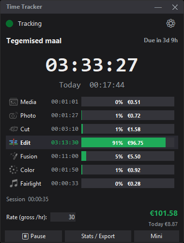
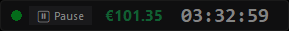
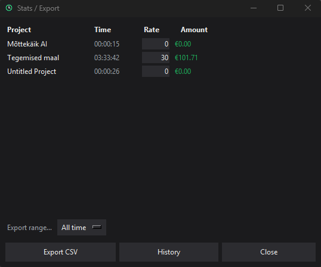

# DaVinci Resolve Time Tracker

A lightweight, always-on-top **time tracker for DaVinci Resolve Studio** — tracks
how long you spend per project and **per page** (Media, Cut, Edit, Fusion, Color,
Fairlight, Deliver, Photo), turns it into **earnings** at your hourly rate, and
exports a tidy CSV for invoicing.

One file. No installs beyond Python. No accounts, no cloud — your data stays on
your machine.

---

## Screenshots

| Main window | Mini pill | Stats / Export |
|:---:|:---:|:---:|
|  |  |  |

---

## What it does

- ⏱️ **Live tracking** of the active project and page, second by second
- 📊 **Per-page bars** — see where your time goes; the active page lights up
- 💶 **Earnings** from your hourly rate, with **today's** and **total** shown
- ⏸️ **Idle auto-pause** (with a live "idle for 3m" readout) and **auto-resume**
- 🪟 **Mini mode** — shrink to a slim pill showing just what you choose
- 🧾 **Stats & CSV export** with a history view and date ranges, ready for invoicing
- 🌗 **Themes & languages** — Dark / Light / System, and 13 UI languages
  (English, Eesti, Latviešu, Lietuvių, Español, Português, Français, Deutsch,
  中文, 日本語, 한국어, हिन्दी, العربية)
- 🔝 **Always-on-top by default** (can be turned off in Settings)

---

## Install

**Easiest — double-click `install.bat`.** It copies the app into Resolve's
Scripts folder, checks you have Python, and reminds you of the one Resolve setting.

**Or manually:** copy `ResolveTimeTracker.py` into
`…\Blackmagic Design\DaVinci Resolve\Support\Fusion\Scripts\Utility\`.

Then, once:

1. In Resolve: **Preferences → System → General → *External scripting using* = Local**
2. **Restart Resolve**

Launch it from **Workspace → Scripts → ResolveTimeTracker**.

### Requirements

- DaVinci Resolve **Studio** on **Windows 10/11**
- **Python 3** for Windows ([python.org](https://www.python.org/downloads/) — keep
  the defaults; Tkinter is included). If it's missing, the app tells you.

That's the whole list — no pip packages to install.

---

## Tips

- Click the **rate** field to change your hourly rate (past time keeps its old rate).
- Hit **Mini** to dock a compact pill out of the way; double-click it to expand.
- **Settings (⚙)** covers language, theme, currency, billing (simple or with tax
  views), idle behaviour, the mini pill, always-on-top, and more.
- **Stats** opens the per-project table, history, and CSV export.

---

## Troubleshooting

**Not in the Scripts menu?** Re-run `install.bat` (or confirm the file is in the
`Scripts\Utility` folder) and restart Resolve.

**Clicking it does nothing?** Make sure external scripting is set to **Local**,
Resolve is open, and Python is installed. Details are logged to
`%APPDATA%\ResolveTimeTracker\poller.log`.

---

## For developers / how it works

<details>
<summary>Architecture, data files, and running from source</summary>

A Resolve script window can't update on a timer, so the single
`ResolveTimeTracker.py` plays three roles depending on how it's started:

| Started as | Runs in | Role |
|------------|---------|------|
| Scripts menu (no args) | Resolve's Python | **Launcher** — starts the tracker in system Python, or surfaces it if already open. No window of its own. |
| `--poller` | System Python | **The tracker** — the live Tkinter window; sole writer of `sessions.json`. |
| `--reader <pid>` | System Python | Polls Resolve into `state.json` (separate process so playback never freezes the UI). |

Run from source (with a console, to see errors):
```powershell
C:\Python314\python.exe "<repo>\ResolveTimeTracker.py" --poller
```

Data lives in `%APPDATA%\ResolveTimeTracker\`:

| File | Contents |
|------|----------|
| `sessions.json` | Per-project, per-page time (tracker is sole writer) |
| `config.json` | Settings & per-project rates / due dates |
| `state.json` | Current project/page (reader → UI) |
| `poller.lock` | Single-instance lock (PID-verified) |
| `poller.log` | Log for all roles |

No third-party dependencies — Python stdlib (incl. Tkinter) plus Resolve's bundled
`DaVinciResolveScript` module. Icons are original art embedded as base64 in the file.

</details>

---

## Disclaimer

Not affiliated with, authorized, or endorsed by Blackmagic Design.
"DaVinci Resolve" is a trademark of Blackmagic Design Pty Ltd. This is an
independent, unofficial tool.
